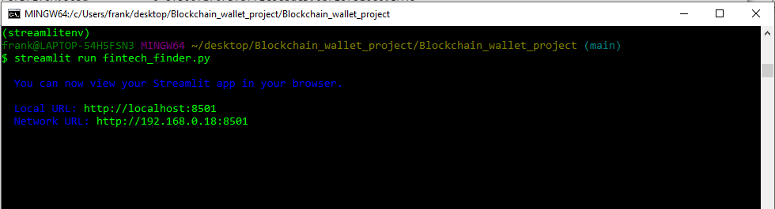
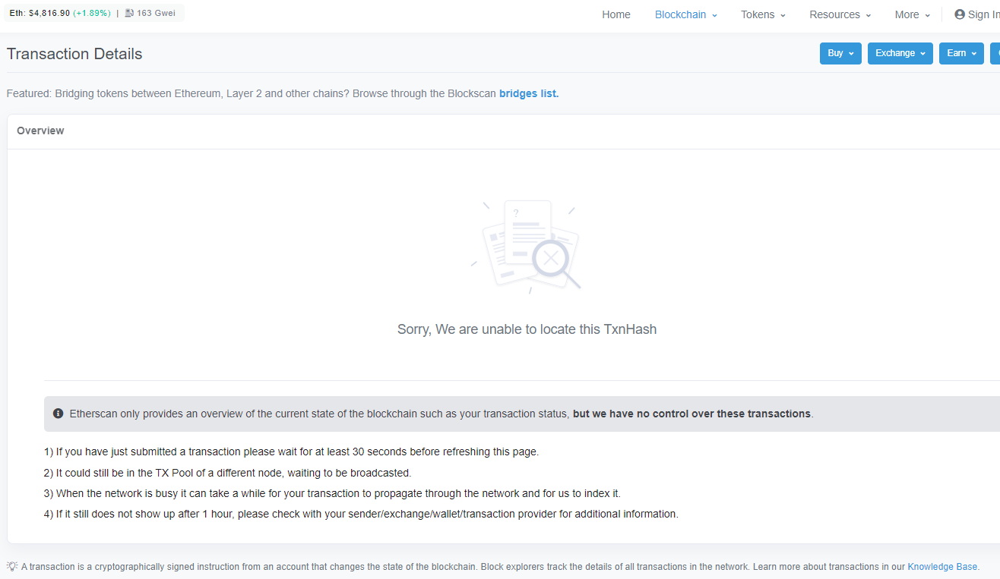

# Blockchain - Python - Wallet
## By Franklin Vaca

The program/code can be found in the crypto_wallet and fintech_finder.py files which were written using Visual Studio. 
The application was created using streamlit and it can be run using Git Bash or Terminal (Git Bash was used for this project). The pictures presented below are located in the Analysis_images folder. The screenshots display the fintech_finder application at work, selecting a Fintech Professional and paying for his/her services and this transaction was validated using the transaction hash.

## **Application screenshot:**

*Fintech Finder* 

 

The application displays all four professionals available to be hired. On the left side, the information from the Ganache account used for the transaction can be seen. The initial balance of Ether was 100.

## **Transaction Information:**
*Transaction details:* 

 

Kendall was the professional selected, for a timeframe of 30 min (0.5 hours), Kendall rate per hour is 0.16 eth and received 0.08 eth for his services. The hash indicates that this transaction (payment) was validated.

*Ganache details:*

 

The 0.08 eth were taken from the first address. The account balance changed from 100 eth to 99.92 eth. 
Record from the transaction:

 

## **Git Bash Fintech Finder Application Information:**

*Git Bash information* 

 

 The local and network URLs are displayed, no error messages were found.

## **Ether Scan Information:**

 The network was too busy to display the transaction on etherscan. The hash number for the transaction is: 0x0a049f6cbd9cd479b0d0543cbe078f362f9293561f47930fb4ec71095d6dda91  

 

 
